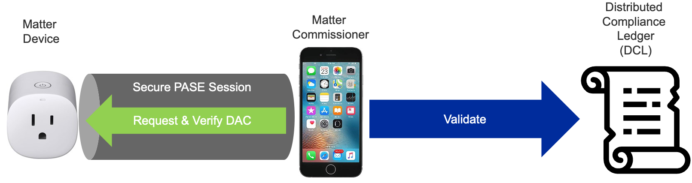
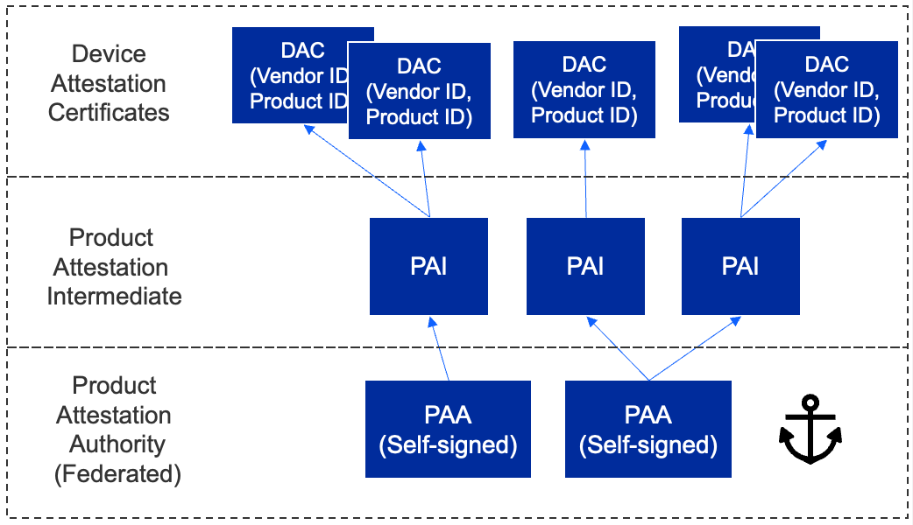
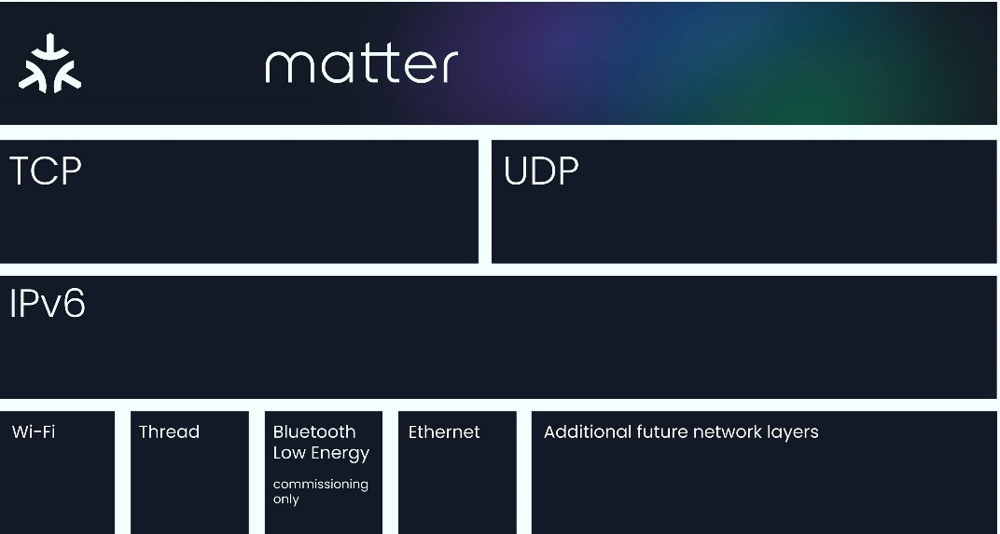
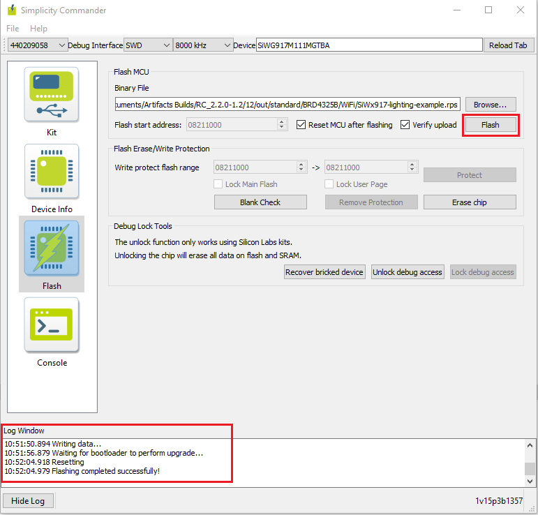

# Flashing the Matter Pre-Built Binary Using Simplicity Commander
- To Flash the application for EFR32 and SiWx917 SOC boards, please use the Simplicity Commander software.
- Before flashing the application for EFR32 Boards, We need to flash **bootloader images** as per board variants

## Flashing the Bootloader Binaries for EFx32 Board using Simplicity Commander

1. Open Simplicity Commander application on your machine.

2. In the Simplicity Commander window, click Select Kit and choose your radio board.

3. In the navigation pane, go to the Flash section.

4. Above "Reload tab" your board will be displayed, click Browse next to the Binary File field and locate the appropriate bootloader binary for your board.

5. Click Flash, the bootloader will be flashed and the Log Window will display a "Flashing completed Successfully" message.

## Flashing the EFR32 Matter Pre-Built Binary using Simplicity Commander

1. Open Simplicity Commander application in your desktop.

2. In the Simplicity Commander window, click Select Kit and choose your radio board.

3. In the navigation pane, go to the Flash section.
   
4. Above beside "Reload tab" board will be displayed, click Browse next to the Binary File field and locate binary.

5. Click Flash, the binary will be flashed and the Log Window will display a "Flashing completed Successfully" message.

## Flashing the SiWx917 SOC Matter Pre-Built Binary using Simplicity Commander

1. Open Simplicity Commander application on your machine.

2. In the Simplicity Commander window, click Select Kit and choose your radio board.

3. In the navigation pane, go to the Flash section.

4. Above beside "Reload tab" board will be displayed, click Browse next to the Binary File field and locate binary.

5. Click Flash, the binary will be flashed and the Log Window will display a "Flashing completed Successfully" message.

