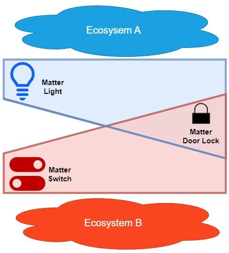
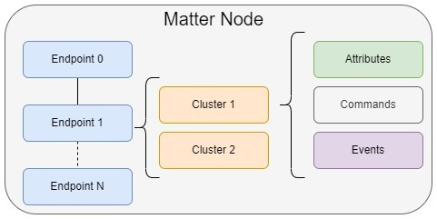
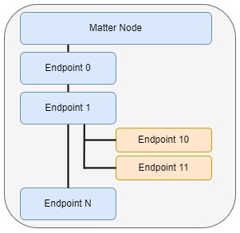

# The Matter Data Model

The Data Model in Matter describes a hierarchical encapsulation of data elements in the Matter network, including, but not limited to, nodes, endpoints, clusters, and device types, where the node is the highest level data element.

A single physical Matter device, such as a light, switch, or door lock, can be represented by one or more nodes. An environment where multiple Matter nodes interoperate is referred to as a Matter fabric. These nodes share a common root of trust. On each separate fabric, a physical Matter device is represented by a node. Every node has a unique network address (Operational Node ID) that makes it uniquely identifiable in the fabric it is on. For example, in the following figure a Matter Lighting device on an Apple HomePod fabric (blue) has an operational node ID unique to the HomePod fabric and a Matter Switch device on a separate Samsung SmartThings Station fabric (red) in the same home has an operational node ID unique to the SmartThings fabric. These IDs may be the same or different; they are independent of each other because they are on two different fabrics.

A Matter device may also be part of more than one fabric and thus is represented on each different fabric by a different node. In following figure, a Matter Door Lock device is on both the HomePod and SmartThings fabrics. Thus, the Door Lock is represented by two different nodes; one for the HomePod fabric and another for the SmartThings fabric. The operational node IDs for the two nodes representing the device may be the same or different; the IDs are independent of each other because the nodes are on two different fabrics.

The following section describes the Matter data model, including Nodes and Device Types.

## Nodes

In the following figure, the hierarchical structure of endpoint, cluster, attributes/commands/events is shown from left to right.

Each node contains the complete application functionality for its device on a single stack. Because of this, nodes can communicate directly with other nodes on the network without the need for an intermediary.

Nodes have a set of related behaviors, known as a role. There are a few main node roles:

### Endpoints

Endpoints enclose one component of a node’s complete functionality; together, they encapsulate all the node’s capabilities needed for functional wholeness. A smart thermostat, for example, could have two endpoints where one would implement the temperature control functionalities and another would implement the temperature monitoring functionalities.

Each of these endpoints are known as a feature set, which is made of clusters that define the attributes, events, and commands of a single endpoint's functionality. There are two distinct types of endpoints in Matter: leaf endpoints and composed endpoints.

- Leaf endpoints, such as Endpoints 0, 10, and 11 in the following figure, do not require other endpoints to function.
- Composed endpoints, such as Endpoint 1 in the following figure, require other endpoints to function. Connector lines indicate the endpoints that a certain endpoint has access to.

Nodes have numbered endpoints starting from 0 that contain their own feature set. Endpoints with the same number but on different nodes may enclose different feature sets. The exception is Endpoint 0, which is reserved exclusively for Utility Clusters. These special clusters are specifically used for enclosing a node’s servicing functionality: the discovery process, addressing, diagnostics, and software updates.

Endpoints are individually addressable to easily modify feature sets separately.

### Clusters

Clusters are collections of data that group the attributes, events, and commands of a specific functionality, representing a single feature in an endpoint’s feature set. A cluster may be thought of as an interface, service, or object class and is the lowest independent functional element in the device data model. Endpoints have multiple clusters to create individual instances of the same functionality for easier unit control. For example, each light on a light strip may have its own designated cluster for independent access.

